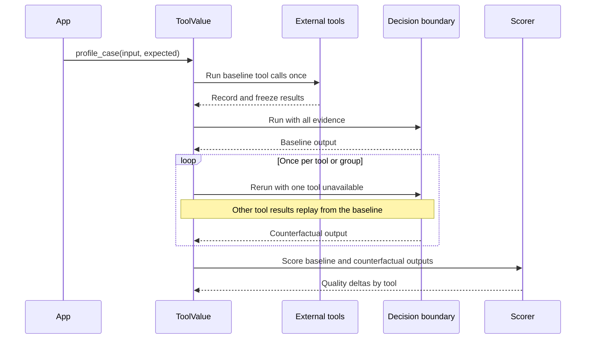

# ToolValue

> Prototype: leave-one-tool-out value profiling for Python agents.

ToolValue answers a question ordinary production traces cannot:

> Which tools materially improve an agent's output relative to their cost and latency?

Add annotations to an existing Python agent. ToolValue records one baseline,
freezes external tool results, reruns the decision step with one tool removed at
a time, and measures the score difference using your evaluator.

```python
from toolvalue import ToolUnavailable, model, profile, tool

@tool(cost=0.002)
def search_company(name: str) -> dict:
    return search_api.lookup(name)

@model(cost=0.003)
def decide(evidence: object) -> str:
    if isinstance(evidence, ToolUnavailable):
        return "unknown"
    return classifier(evidence)

def accuracy(output: str, expected: str) -> float:
    return float(output == expected)

@profile(task="company_classification", scorer=accuracy)
def classify_company(name: str) -> str:
    return decide(search_company(name))
```

The decorated function still behaves normally:

```python
result = classify_company("Acme")
```

Profiling is an additional method on that function:

```python
case = classify_company.profile_case("Acme", expected="manufacturing")
print(case.counterfactuals[0].delta)
```

`@model` means “rerun this decision boundary during a counterfactual.” It can
wrap an LLM call, a traditional model, rules, or any deterministic function. No
AI is required by the profiler.

## How it works



The boundaries have deliberately different behavior:

| Annotation | Use it for | Counterfactual behavior |
|---|---|---|
| `@profile` | The agent/task entry point | Coordinates baselines, replays, scoring, and storage |
| `@tool` | External evidence or side effects | Replays the frozen baseline result or returns `ToolUnavailable` |
| `@model` | Reasoning or decision logic | Executes again with the counterfactual evidence |

For centralized tool registries, use the middleware adapter instead of editing
each function:

```python
from toolvalue import middleware

registry["search"] = middleware().wrap(
    "search",
    registry["search"],
    cost=0.001,
)
```

## Install

ToolValue is currently a source-distributed prototype:

```bash
git clone https://github.com/EswarSk/toolvalue.git
cd toolvalue
python3 -m venv .venv
.venv/bin/python -m pip install -e .
```

Run the bundled fixture demo:

```bash
.venv/bin/toolvalue demo --json .toolvalue/report.json
.venv/bin/toolvalue analyze .toolvalue/report.json
```

## Evaluate a dataset

The application owns the scorer and labeled evaluation cases. ToolValue does
not invent a quality score or require an AI judge.

```python
from toolvalue import EvalCase

report = classify_company.evaluate([
    EvalCase(
        args=(company_name,),
        expected=expected_industry,
        metadata={"segment": segment},
    )
    for company_name, expected_industry, segment in dataset
])

for item in report.tools:
    print(item.unit, item.mean_quality_delta, item.avg_latency_ms, item.avg_cost)
```

Scorers may return a single number or named components with an `overall` value.
Results can be segmented only by metadata supplied by the application:

```python
from toolvalue import aggregate_by_metadata

reports_by_segment = aggregate_by_metadata(report.profiles, "segment")
```

## Reproducible public GitHub example

The separate [live GitHub sample](sample-project/README.md) uses four real,
read-only public API calls per repository and a transparent deterministic
classifier. No GitHub token or paid model is required.

Observed on August 24, 2026 across six labeled repositories:

| Result | Observed value |
|---|---:|
| Correct classifications | 6 / 6 |
| Baseline quality | 99.6% |
| Replay integrity | 100% |
| Baseline network requests | 24 / 24 expected |
| Counterfactual network requests | 0 |
| Decision runs | 30 / 30 expected |

| Evidence tool | Mean quality delta | Useful rate | Mean latency |
|---|---:|---:|---:|
| Repository metadata | +3.10% | 100% | 373 ms |
| README | +3.03% | 100% | 337 ms |
| Topics | +2.73% | 100% | 384 ms |
| Languages | 0.00% | 0% | 280 ms |

The example therefore identifies language breakdown as a conditional-skip
candidate for this task: it added latency without changing the measured score.
Public repository contents and API latency can change, so reruns may differ.

```bash
cd sample-project
python3 -m venv .venv
.venv/bin/python -m pip install -r requirements.txt
env -u GITHUB_TOKEN .venv/bin/python -m live_repo_profiler --limit 6
```

## Integration with Hugging Face smolagents

To test ToolValue inside a well-known agent runtime, we searched GitHub for
actively maintained Python projects with native multi-tool execution. We chose
[`huggingface/smolagents`](https://github.com/huggingface/smolagents)—about
29,000 stars when evaluated—because its `ToolCallingAgent` is lightweight,
model-agnostic, and runs locally without Docker.

The [smolagents integration](smolagents-sample/README.md) pins the stable
`smolagents==1.26.0` release and uses the actual upstream agent loop, tools,
action/observation memory, and final-answer protocol. A scripted local model
makes the run deterministic and key-free; output quality uses pure exact-match
labels rather than model-as-judge scoring.

Observed across five multi-tool incident-triage cases:

| Result | Observed value |
|---|---:|
| Baseline accuracy | 100% |
| Replay integrity | 100% |
| Baseline fixture-tool executions | 20 / 20 expected |
| Counterfactual fixture-tool executions | 0 |
| Counterfactuals completed | 20 |
| smolagents model-loop calls | 125 / 125 expected |

| smolagents tool | Mean accuracy delta | Useful rate |
|---|---:|---:|
| Deployment signal | +40% | 40% |
| Telemetry signal | +40% | 40% |
| Runbook signal | +20% | 20% |
| On-call lookup | 0% | 0% |

The profiler correctly identified the on-call lookup as irrelevant to the
classification decision while proving that counterfactuals did not reexecute
the underlying tools.

```bash
cd smolagents-sample
python3 -m venv .venv
.venv/bin/python -m pip install -r requirements.txt
.venv/bin/python -m smolagents_profiler
```

To replace the scripted decision adapter with a real OpenRouter LLM, add
`OPENROUTER_API_KEY` to `smolagents-sample/.env` and run one paid case first:

```bash
cd smolagents-sample
.venv/bin/python -m smolagents_profiler \
  --backend openrouter --model openai/gpt-4o-mini --limit 1
```

The [integration instructions](smolagents-sample/README.md) explain the expected
request count and how to verify LLM calls, token usage, reported cost, and
replay integrity.

## Strict replay

Counterfactual runs never fetch new external evidence:

- matching calls return a frozen copy of their recorded result;
- the ablated tool returns `ToolUnavailable(reason="counterfactual_ablation")`;
- an unseen, non-ablated call marks the counterfactual as diverged;
- `replay_policy="never"` prevents side-effecting tools from being replayed;
- repeated calls are matched by normalized arguments and occurrence order;
- tools sharing a `group` can be ablated together.

This avoids confusing live-data drift with tool value.

## Storage and privacy

In-process counterfactual replay temporarily needs tool results. The
`SQLiteStore` persists metadata and hashes by default—not raw arguments,
outputs, tool results, or expected labels:

```python
from toolvalue import SQLiteStore

store = SQLiteStore(".toolvalue/profiles.db")

@profile(task="company_classification", scorer=accuracy, store=store)
def classify_company(...):
    ...
```

Raw content persistence is opt-in with `SQLiteStore(..., capture_content=True)`.

## Prototype scope

Implemented:

- synchronous and asynchronous `@profile`, `@tool`, and `@model` boundaries;
- frozen result replay and standardized unavailable-tool sentinels;
- strict divergence detection and grouped ablations;
- deterministic or asynchronous application-defined scorers;
- quality, cost, latency, useful-rate, harmful-rate, divergence, confidence
  interval, and value-per-dollar aggregation;
- in-memory and SQLite metadata stores;
- an executable fixture demo, a live public-API sample, and a real smolagents
  integration.

This is leave-one-out counterfactual value, not complete causal attribution.
Redundant and interacting tools can require pairwise ablations or Shapley-style
analysis. The output is an optimization signal, not an automatic deletion
decision.

## Verify

```bash
python3 -m unittest discover -s tests -v
PYTHONPATH=sample-project/src:. python3 -m unittest discover -s sample-project/tests -v
PYTHONPATH=smolagents-sample/src:. python3 -m unittest discover -s smolagents-sample/tests -v
```
